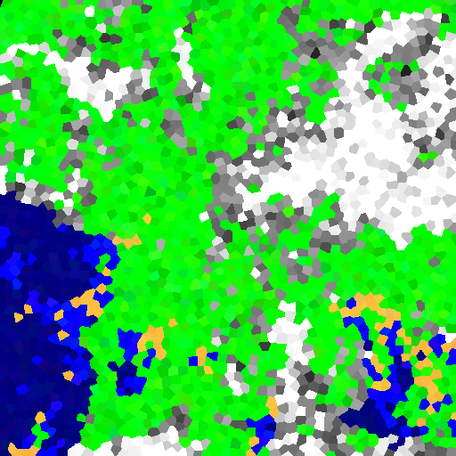
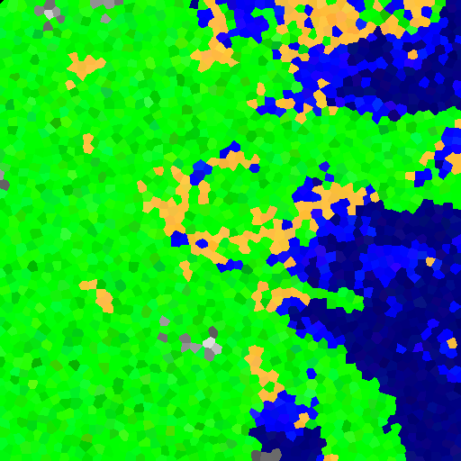
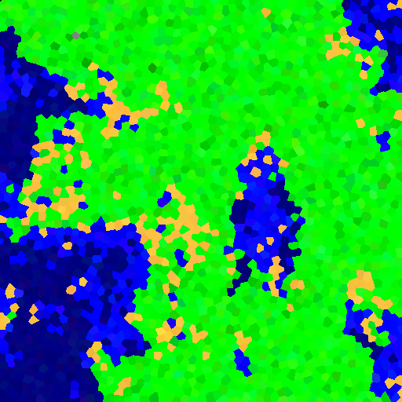

# Poisson Disk landscape

## The idea

Can we generate a convincing simula of a 'fractal landscape' using [Bridson's algorithm](https://www.cs.ubc.ca/~rbridson/docs/bridson-siggraph07-poissondisk.pdf) to generate a Poisson Disk sampling of the plane?

## Example output

### A nice coastline

### Plains

### An island with a lake

## Future

[Scalloped optimisation](http://www.cs.virginia.edu/~gfx/pubs/antimony/antimony.pdf)
